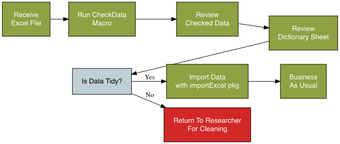

```{r setup, include=FALSE}
knitr::opts_chunk$set(echo = TRUE)
currentDict = list.files(path='images/',pattern='*.xlsm')
currentDict <- currentDict[length(currentDict)]
# This is necessary to ensure that the figures appear on the website.
if (! file.exists('.nojekyll')) file.create('.nojekyll')
if (! file.exists('docs/.nojekyll')) file.create('docs/.nojekyll')

library(tidyverse)
library(reportRmd)
```


# Overview

An excel macro has been developed that will be stored in your personal Excel workbook which will make the macro available to run on any data file you open.

The `importExcel` package contains functions for processing Excel files that the macro has been run on


```{r, eval=F, include=F}
library(DiagrammeR)
tmp <- grViz('digraph{

      # Global graph settings
    nodesep = 0.1;  # Decrease space between nodes
    ranksep = 0.1;  # Decrease space between ranks
    splines = false;  # Use straight edges (no curvature)
    graph[rankdir = TB]
      
        subgraph cluster_excelData {
        graph[fontname = Helvetica,fontcolor = black]
        bgcolor="#bed0d4"
        label ="In Excel"
                subgraph cluster_dictionary {
        graph[fontname = Helvetica, fontcolor = white,
        shape = rectangle]
        bgcolor="#8da242"
        style = rounded
         label = "Researcher"
         node[fontname = Helvetica, fontcolor = darkslategray,style="filled",
         shape = rectangle, fillcolor = "#f2f4ea", margin = 0.25]
         B[label = "Excel Data File\n to Biostats"]

         }
        node[fontname = Helvetica, fontcolor = darkgray, style="filled",
        shape = rectangle, fillcolor = "#f0f4f5", margin = 0.25]
        C[label = "Run CheckData Macro"]
        D[label = "Review Dictionary Sheet"]
        node[fontname = Helvetica, fontcolor = darkslategray, style="filled",
        shape = rounded, fillcolor = "#f0f4f5", margin = 0.25]
        C2[label = "Data Dictionary Created by Macro"]
        node[fontname = Helvetica, fontcolor = darkgray, style="filled",
        shape = oval, fillcolor = "#f0f4f5", margin = 0.25]
        E[label = "Any Problems?"]
        node[fontname = Helvetica, fontcolor = darkgray, style="filled",
        shape = rectangle, fillcolor = "#f0f4f5", margin = 0.25]
        F[label = "Send Checked Excel File\nBack to Researcher"]
        F2[label="Update Dictionary:\nadd factor labels\nupdate variable labels"]
        }
        
                subgraph cluster_inR {
        graph[fontname = Helvetica,fontcolor = black]
        bgcolor="#bed0d4"
        label ="In R"

                subgraph cluster_entry {
        graph[fontname = Helvetica,fontcolor = black]
        style=rounded
        bgcolor="#ccd5ab"
        label = "importExcel Package"
         node[fontname = Helvetica, fontcolor = darkgray,style="filled",
         shape = rectangle, fillcolor = "#f2f4ea", margin = 0.25]
         G[label = "Import Data\n(read_excel_with_dictionary)"]
                 node[fontname = Helvetica, fontcolor = darkslategray, style="filled",
        shape = rounded, fillcolor = "#f0f4f5", margin = 0.25]
        H[label="Automated import based on dictionary:\ndates converted if possible\nfactors created from codes\nnumeric data cleaned\nvariable labels added"]
        }
  
                subgraph cluster_stats {
        graph[fontname = Helvetica,fontcolor = black]
        style=rounded
        bgcolor="#ccd5ab"
        label = "reportRmd Package"
        node[fontname = Helvetica, fontcolor = darkgray, style="filled",
        shape = rectangle, fillcolor = "#f0f4f5", margin = 0.25]
        I[label = "summary stats\nwith labels"]
                }
                }

    
      edge[color = black, arrowhead = vee, arrowsize = 1.25,len=20]
      B -> C -> C2 -> D
      D-> E 
       E-> F [label = "Yes"]
       E-> F2 [label = "No"]
       G -> H -> I
 
      }',width="50%",height="50%")

# Save as image
tmp = DiagrammeRsvg::export_svg(tmp)
tmp = charToRaw(tmp) # flatten
rsvg::rsvg_png(tmp, "images/flow.png") # saved graph as png in current working directory

```


## Workflow Development

This is a work in progress!

If you have comments/suggestions/bugfixes please raise an issue on gitHUB. 

To do this:

Go to the [issues page for the package](https://github.com/biostatsPMH/importExcel/issues)

Click New Issue:


**Please DO NOT send an email.** Using gitHub allows everyone to see the issues and how they have been resolved.


You will need to set up a gitHub account to raise an issue.


# Setup

The first step is to install the package - this will load the importExcel package into R, and it will also save the Excel macros files onto your computer

### Installing the package

You can install the latest version of importExcel from [GitHub](https://github.com/) with:

``` r
# install.packages("devtools")
devtools::install_github("biostatsPMH/importExcel")
```

*This is a department-only package, it is not available on CRAN*


## Installing the Excel Macro


The excel macro consists of two files that need to be stored in your personal.xlsb workbook: The `dataChecker.bas` file and the `Dictionary.cls` file.

Once these two files are saved into your personal workbook the macro will be available on all the files you open in Excel. The macro stays on your machine in your workbook, it is not added to files that you check.


## Creating your Personal Workbook

Once your personal workbook is created you can store macros here that will be available to use on all the files you open.

1.	Ensure that you can see the Developer Tab in Excel  - it will be in the menu at the top, if you see the Developer Tab jump to step 3 otherwise continue to step 

 

2.	**To show the Developer Tab**
  
  a.	On the File tab, go to Options > Customize Ribbon.
  b.	Under Customize the Ribbon and under Main Tabs, select the Developer check box.

3.	**To Create your Personal Macro Workbook**

  a.	Click the Developer Tab
  b.	Click Record Macro
  c.	Change the Store macro in location to Personal Macro Workbook 
  
  d.	Click OK
  e.	Do anything – highlight some cells, type some text, anything. This creates your personal macro workbook.
  f.	Click Stop Recording 

## Adding the Macro to your Personal Workbook

First - locate the VBA files 

The macro files are downloaded with the package. Copy and run the following code chunk in R to open the folder containing the files.

```{r,eval=F}
macroFile <- "dataChecker.bas"

file_path <- system.file("extdata", macroFile, package = "importExcel")

# Get the directory path containing the file
folder_path <- dirname(file_path)

# Check if the folder exists
if (dir.exists(folder_path)) {
  # Open the folder using the default system file explorer
  
  # For Windows
  if (Sys.info()['sysname'] == "Windows") {
    shell.exec(folder_path)
  }
  
  # For macOS
  else if (Sys.info()['sysname'] == "Darwin") {
    system(paste("open", shQuote(folder_path)))
  }
  
  # For Linux
  else if (Sys.info()['sysname'] == "Linux") {
    system(paste("xdg-open", shQuote(folder_path)))
  }
  
  # If the OS is not recognized
  else {
    message("Unable to open folder: Unrecognized operating system")
  }
} else {
  message("Folder not found")
}
```


**Now, in Excel**

  1.	Click Visual Basic from the Developer Tab (If you can't see this, click the Developer Tab)
  
  
  1.	Click on VBAproject(Personal.XLSB)
  
  
  
  1.	Click File > Import File
  1.	Import the Dictionary.cls file
  1.  Import the dataChecker.bas file
  1.	Click Save to save the macros to Personal.XLSB


## Check the Installation

1.	Click on the Developer Tab
2.	Click The Macros button

3.	The PERSONAL.XLSB!CheckData macro should appear in the list of macro names


**That's it - you are all set to use the macro**

# Workflow

```{r, eval=F, include=F}
library(DiagrammeR)
tmp <- grViz('digraph{

      # Global graph settings
    splines = false;  # Use straight edges (no curvature)
    
        graph[rankdir = LR]
    
    subgraph c1{  
        graph[rankdir = TB]
    node[fontname = Helvetica, fontcolor = white,style="filled",
         shape = rectangle, fillcolor = "#8da242", margin = 0.25]
         A[label = "Receive \nExcel File"]
         B[label = "Run CheckData\nMacro"]
         C[label = "Review\nChecked Data"]
         D[label = "Review\nDictionary Sheet"]
         F[label = "Import Data\nwith importExcel pkg"]
         H[label = "Business\nAs Usual"]
            
    node[fontname = Helvetica, fontcolor = black,style="filled",
         shape = rectangle, fillcolor = "#bed0d4", margin = 0.25]
        E[label = "Is Data Tidy?"]

    node[fontname = Helvetica, fontcolor = white,style="filled",
         shape = rectangle, fillcolor = "#d32828", margin = 0.25]
         G[label = "Return To Researcher\nFor Cleaning"]
        
        A->B->C->D->E
        E->G [label = "No"]
        E->F [label = "Yes"]
        F->H
        {rank=same;B;E;}
        
        
         }}',width="50%",height="50%")

# Save as image
tmp = DiagrammeRsvg::export_svg(tmp)
tmp = charToRaw(tmp) # flatten
rsvg::rsvg_png(tmp, "images/workflow.png") # saved graph as png in current working directory

```



## Using the CheckData Macro
This macro will:

- highlight problems with the data on the data sheet
- create a data dictionary sheet at the end of the document that is used to import the data
 

::: {.callout-note}

**Please note** Excel code is slow to run – this may take a 15-30 seconds for large files.

:::

### To Run the Macro
1. Open the data file in Excel
1. Make sure the data sheet you want to check is the active sheet
1.	Click The `Macros` button (Click on the Developer Tab if you don't see this)


2.	Select the PERSONAL.XLSB!CheckData macro and click `Run`


**To undo the formatting:**

1.	Click on the Developer Tab
2.	Click Macros
3.	Run the PERSONAL.XLSB!RemoveFormatting macro to remove all formatting 
-or-
4. Run the PERSONAL.XLSB!removeColumnFormatting to remove formatting for a single column


## Editing the Dictionary Sheet

Running the macro creates a dictionary sheet that summarises all the variables in the data.

The columns **highlighted in green** can be edited to change the final data frame created by the importExcel package. 

For example:

  - To omit a column set the value to FALSE in the *Import* columns. 
  - To recode variables set values in the Value_Label column. *Note that if you set value labels for a column, any values without labels will be set to `NA`.*
  - To change the label that appears in the report edit the Label_For_Report column
  - To change the variable name edit the Suggested_Name


::: {.callout-caution}

**Caution:** If you change the names of the column headers in the dictionary you will not be able to use the importExcel package to import and code the data.

You can add additional columns for your own recode keeping, these will just be ignored on import.

:::

# The importExcel Package


The importExcel package has only one exported function: `read_excel_with_dictionary`

This function performs the following tasks:

- reads in the data sheet
- reads in the dictionary sheet

(these must be in the same Excel file)

- applies any variable recodings specified in the dictionary
- adds labels to the variables 
- attempts to harmonise messy date columns

The function returns an object with four elements:

- the recoded data
- a list of values omitted from numeric columns
- a list of converted dates (if multiple formats were present in columns)
- the dictionary used to convert the data (without excluded columns and ensuring non-duplicate variable names)


## Example Import

You need to provide the function with the location (path and filename) of the Excel file, the name of the sheet containing the data and the name of the sheet containing the dictionary.

```{r example, eval=F,echo=T}
library(importExcel)
data_file <- system.file("extdata", "study_data.xlsx", package = "importExcel")

# This will read in the file, add variable labels and recode variables to 
# factors as specified in the dictionary sheet
file_import <- read_excel_with_dictionary(data_file = data_file,
                                          data_sheet = "data",dictionary_sheet = "dict")

# extract the recoded-data
coded_data <- file_import$coded_data

file_import contains the following objects:
# check warnings
file_import$warnings

# check for text omitted from numeric data
file_import$numeric_converstions

# check for attempted date conversions
file_import$date_converstions

# Look at the dictionary used
file_import$updated_dictionary

```

```{r include=FALSE}
library(importExcel)
data_file <- system.file("extdata", "study_data.xlsx", package = "importExcel")
file_import <- read_excel_with_dictionary(data_file = data_file,
                                          data_sheet = "data",dictionary_sheet = "dict")
coded_data <- file_import$coded_data

```

Describe the coded data:

```{r}
require(tidyverse)
require(reportRmd)

coded_data |> 
  select(!studyID) |> 
  rm_compactsum(xvars=everything())

```


## Sample Data {#sec-sample-data}

The package installs two sample files: `study_data.xlsx` and `study_data_messy.xlsx`

The following code can be copied and run to view the first file:

```{r,eval=F}
tidy_data <- "study_data.xlsx"
messy_data <- "study_data_messy.xlsx"

file_path <- system.file("extdata", tidy_data, package = "importExcel")

# Check if the file exists
if (file.exists(file_path)) {
  # Open the file using the default system application (Excel)
  
  # For Windows
  if (Sys.info()['sysname'] == "Windows") {
    shell.exec(file_path)
  }
  
  # For macOS
  else if (Sys.info()['sysname'] == "Darwin") {
    system(paste("open", shQuote(file_path)))
  }
  
  # For Linux
  else if (Sys.info()['sysname'] == "Linux") {
    system(paste("xdg-open", shQuote(file_path)))
  }
  
  # If the OS is not recognized
  else {
    message("Unable to open file: Unrecognized operating system")
  }
} else {
  message("File  not found in the package's inst/extdata directory")
}

```


